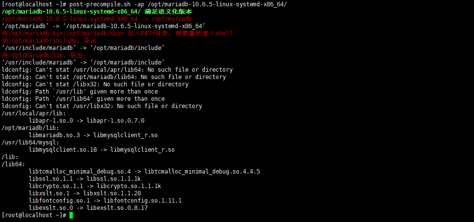
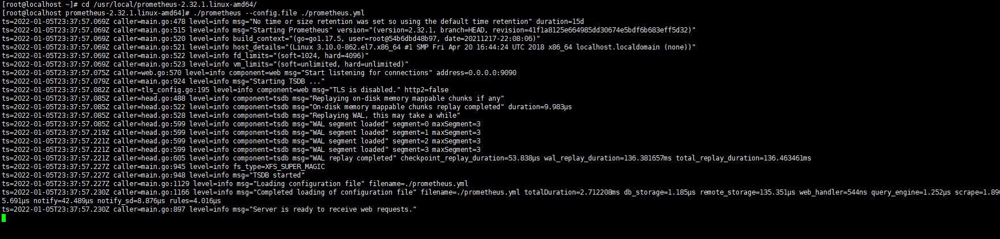
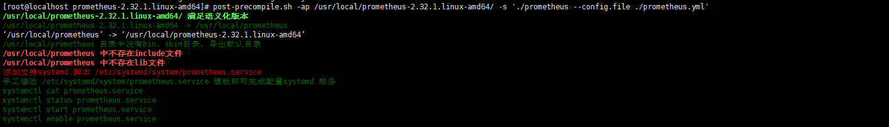

# post-precompile
 将编译后或预编译目录完成后续操作

安装到PATH目录
```bash
install post-precompile.sh /usr/local/bin/
```


# 示例

## 安装mariadb二进制程序包

```bash
[root@localhost ~]# tar xvf mariadb-10.6.5-linux-systemd-x86_64.tar.gz -C /opt
# 由于mariadb自带启动脚本，将不需要安装systemd服务脚本
[root@localhost ~]# post-precompile.sh -ap /opt/mariadb-10.6.5-linux-systemd-x86_64/
```



切换终端


## 安装prometheus

```bash
[root@localhost ~]# tar xvf /mnt/prometheus-2.32.1.linux-amd64.tar.gz -C /usr/local/
```

切换目录测试执行

```bash
[root@localhost ~]# cd /usr/local/prometheus-2.32.1.linux-amd64/
[root@localhost prometheus-2.32.1.linux-amd64]# ./prometheus --config.file ./prometheus.yml
```



完成一键安装

```bash
[root@localhost ~]# post-precompile.sh -ap /usr/local/prometheus-2.32.1.linux-amd64/ -s './prometheus --config.file ./prometheus.yml'
```



```bash
[root@localhost prometheus-2.32.1.linux-amd64]# systemctl start prometheus.service
```


